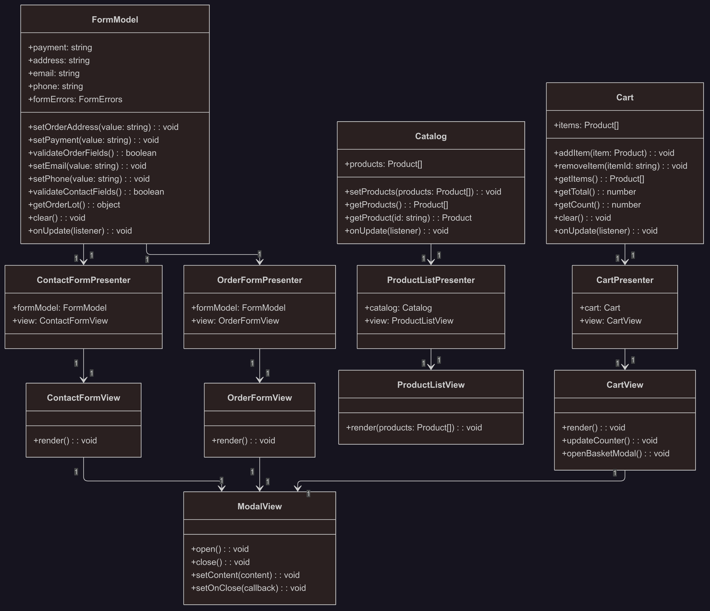

# Web-Larek (WEB-ларёк)

Интернет-магазин товаров для веб-разработчиков. Проект реализован на TypeScript по паттерну MVP.

---

## 🌐 Ссылки на проект

- [Репозиторий](https://github.com/alsakharov/web-larek-frontend)
- [GitHub Pages](https://alsakharov.github.io/web-larek-frontend/)

---

## 🚀 Используемый стек

- **TypeScript** — строгая типизация
- **SCSS** — стилизация с переменными и вложенностью
- **Webpack** — сборка и управление зависимостями
- **Babel** — транспиляция JS
- **PostCSS (Autoprefixer)** — автопрефиксы для CSS
- **ESLint + Prettier** — поддержка качества и стиля кода
- **REST API** — взаимодействие с бекендом ([larek-api.nomoreparties.co](https://larek-api.nomoreparties.co))

---

## 🚦 Запуск проекта

1. Установите зависимости:
   ```
   npm install
   ```
2. Запустите dev-сервер:
   ```
   npm run start
   ```
3. Откройте [http://localhost:8080](http://localhost:8080) в браузере.

---

## 📦 Структура проекта

```
src/
  ├── components/           // UI-компоненты и презентеры
  ├── models/               // Модели данных
  ├── types/                // Типы данных
  ├── utils/                // Вспомогательные функции и константы
  ├── scss/, common.blocks/ // Стили
  ├── images/               // Картинки
  ├── pages/                // HTML-файлы
  └── index.ts              // Точка входа
```

---

## 📝 Типы данных

```typescript
interface Product {
  id: string;
  title: string;
  description: string;
  price: number | null;
  image: string;
  category: string;
}
```
*Типы описаны в [`src/types.ts`](src/types.ts).*

---

## 🏗️ Архитектура

Проект построен по принципу разделения на три слоя (MVP):

### 1. Модели (`src/models`)
- Хранит и управляет данными приложения.
- Не взаимодействует с DOM.
- Классы: `Catalog`, `Cart`, `FormModel`.

### 2. Представления (`src/components`)
- Отвечает за отображение данных и работу с DOM.
- Классы: `ProductListView`, `CartView`, `OrderFormView`, `ContactFormView`, `ErrorView`, `ModalView`, `SuccessModalView`, `BasketItemView`.

### 3. Презентер (`src/components`)
- Связывает модель и представление, управляет бизнес-логикой.
- Классы: `OrderPresenter`, `CartPresenter`, `ProductListPresenter`.

---

## 📚 Описание основных классов

### Catalog (`src/models/catalog.ts`)
- **Назначение:** Хранит список товаров, уведомляет о его изменениях.
- **Конструктор:** `constructor()`
- **Поля:**  
  - `products: Product[]` — массив товаров.
  - `updateListeners: (() => void)[]` — слушатели изменений.
- **Методы:**  
  - `setProducts(products: Product[]): void`
  - `getProducts(): Product[]`
  - `getProduct(id: string): Product | undefined`
  - `onUpdate(listener: () => void): void`

### Cart (`src/models/cart.ts`)
- **Назначение:** Хранит товары корзины, управляет ими.
- **Конструктор:** `constructor()`
- **Поля:**  
  - `items: Product[]`
  - `updateListeners: (() => void)[]`
- **Методы:**  
  - `addItem(item: Product): void`
  - `removeItem(itemId: string): void`
  - `getItems(): Product[]`
  - `getTotal(): number`
  - `getCount(): number`
  - `clear(): void`
  - `onUpdate(listener: () => void): void`

### FormModel (`src/models/FormModel.ts`)
- **Назначение:** Хранит данные формы заказа и контактов.
- **Поля:**  
  - `payment: string`
  - `email: string`
  - `phone: string`
  - `address: string`
  - `formErrors: FormErrors`
- **Методы:**  
  - `setOrderAddress(value: string): void`
  - `setPayment(value: string): void`
  - `validateOrder(): boolean`
  - `setEmail(value: string): void`
  - `setPhone(value: string): void`
  - `validateContacts(): boolean`
  - `getOrderLot(): object`
  - `clear(): void`

### CartView (`src/components/CartView.ts`)
- **Назначение:** Отображает корзину, управляет её DOM.
- **Конструктор:**  
  - `constructor(root: HTMLElement, showBasketNotify: (msg: string) => void, openOrder: () => void)`
- **Поля:**  
  - Элементы разметки внутри блока корзины: `.header__basket-counter`, шаблон корзины, модальное окно.
- **Методы:**  
  - `setPresenter(presenter: CartPresenter): void`
  - `renderBasketContent(): HTMLElement`
  - `updateCounter(): void`
  - `openBasketModal(): void`
  - `update(): void`
  - `render(): void`

---

## 🔗 Взаимодействие компонентов

- Все классы связываются через передачу экземпляров в конструктор.
- Модальные окна открываются через экземпляр `ModalView`.
- Данные о товарах и корзине хранятся только в моделях.
- UI обновляется через методы компонентов View.

---

## 📄 Документация и правила оформления

- В документации описываются только интерфейсы данных, с которыми работает приложение (например, Product).
- Классы описываются текстом: назначение, зона ответственности, конструктор, поля, методы.
- Для моделей подробно описываются все поля. Для представлений — перечисляются элементы разметки, которые сохраняются в полях.
- Описаны слои архитектуры: Модель, Представление, Презентер.
- Класс модального окна один, остальные классы только генерируют контент.
- Не создаются классы для объектов, которые приходят с сервера (например, товар).

---

## 📈 Блок-схема 



---

## 💡 Пример взаимодействия слоёв (MVP)

**Сценарий: пользователь добавляет товар в корзину**

1. Класс представления `ProductListView` реагирует на клик пользователя по кнопке "В корзину".
2. Презентер `CartPresenter` получает событие, вызывает метод модели `Cart.addItem(product)`.
3. В модели `Cart` в поле `items` добавляется новый товар, генерируется событие обновления.
4. Презентер `CartPresenter` получает событие, вызывает метод рендера корзины у `CartView`, передавая актуальные данные.
5. Класс представления `CartView` перерисовывает корзину, отображая обновлённый список товаров и сумму.

---

## 🏁 Примечания

- Классы описаны текстом, интерфейсы только для данных.
- Класс модального окна один, остальные классы только генерируют контент.
- Названия файлов соответствуют названиям классов и лежат в правильных папках согласно архитектуре.

---