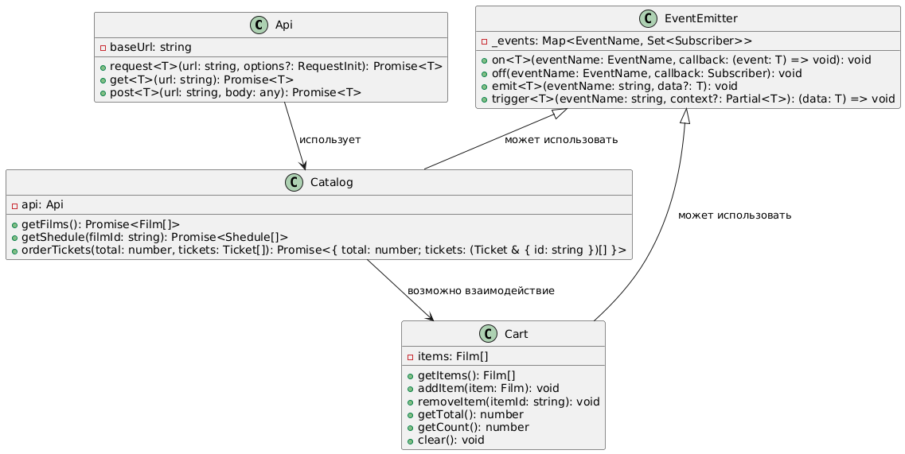

# Web-Larek (WEB-ларёк)

Интернет-магазин товаров для веб-разработчиков с реализацией собственной MVP-архитектуры.

---

## 🚀 Используемый стек

- **TypeScript** — для типизации и надёжности кода
- **SCSS** — для стилизации с использованием вложенности и переменных
- **Webpack** — сборка проекта, управление ассетами и модулями
- **Babel** — транспиляция современного JavaScript для поддержки разных браузеров
- **PostCSS (Autoprefixer)** — автоматическое добавление префиксов CSS
- **ESLint + Prettier** — поддержание стиля и качества кода
- **EventEmitter (брокер событий)** — организация коммуникации между компонентами
- **API** — взаимодействие с бекендом через REST API (https://larek-api.nomoreparties.co)

## Архитектура

Проект следует паттерну MVP:

- `models/` — бизнес-логика, хранение данных (`Catalog`, `Cart`)
- `components/` — абстрактные или UI-компоненты
- `types/` — типы данных, приходящих из API
- `scss/`, `common.blocks/` — стили
- `index.ts` — инициализация и запуск приложения

